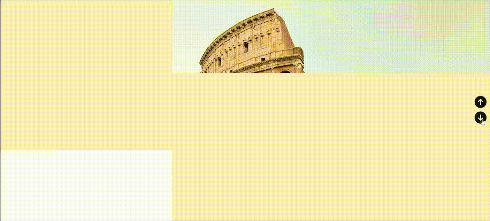

# css-and-js-code-snippets :yellow_heart:

A collection of real-life code snippets written in CSS and JavaScript for every web development project. Each folder contains the stylesheet and script file (if required).

#### Categories :maple_leaf:

This repository is divided into mentioned categories. You may navigate accordingly to find cool web components to add to your project!

- [Buttons](#buttons-sparkles)
- [Loaders](#loaders-sparkles)
- [Form Fields](#form-fields-sparkles)
- [Carousels](#carousels-sparkles)
- [Hover Effects](#hover-effects-sparkles)
- [Miscellaneous](#miscellaneous-sparkles)

## Buttons :sparkles:

Buttons help to lead the user to a specific action on a web page. I've got cool animated buttons for different actions for you. Pick the right one for your project!

- [Delete Button](#delete-button-zap)
- [Download Button](#download-button-zap)
- [Floating Action Button](#floating-action-button-zap)
- [Search Button](#search-button-zap)
- [Send Button](#send-button-zap)
- [Share Button](#share-button-zap)
- [Subscribe Button](#subscribe-button-zap)
- [Ripple Button](#ripple-button-zap)

### Delete Button :zap:

A Flip Delete Button to show the confirm box before deleting! Uses JS to handle the click events.  
:paperclip: View code [here](https://github.com/Ritika-Agrawal811/css-and-js-code-snippets/tree/main/Buttons/Delete_Button).

 

### Download Button :zap:

A Download Button animated to show download progress! Uses JS to handle the click event. 
:paperclip: View code [here](https://github.com/Ritika-Agrawal811/css-and-js-code-snippets/tree/main/Buttons/Download_Button).

 

### Floating Action Button :zap:

A Floating Action Button made with "checkbox" input tag to show options when clicked. 
:paperclip: View code [here](https://github.com/Ritika-Agrawal811/css-and-js-code-snippets/tree/main/Buttons/Floating_Action_Button).

 

### Search Button :zap:

A Search Button slide in animation for navigation bars! Uses JS to handle the click event. 
:paperclip: View code [here](https://github.com/Ritika-Agrawal811/css-and-js-code-snippets/tree/main/Buttons/Search_Button).

 

### Send Button :zap:

A Send Button with paper plane flying animation to show "sent" state! Uses JS to handle the click event. Fontawesome is used for the icon. 
:paperclip: View code [here](https://github.com/Ritika-Agrawal811/css-and-js-code-snippets/tree/main/Buttons/Send_Button).

 

### Share Button :zap:

A Share Button showing all social icons when hovered over! Fontawesome is used for the icons. 
:paperclip: View code [here](https://github.com/Ritika-Agrawal811/css-and-js-code-snippets/tree/main/Buttons/Share_Button).

 

### Subscribe Button :zap:

A Subscribe Button animation to take in a user's email and get them subscribed to your work! Uses JS for click events. 
:paperclip: View code [here](https://github.com/Ritika-Agrawal811/css-and-js-code-snippets/tree/main/Buttons/Subscribe_Button).

 

### Ripple Button :zap:

A Ripple Button Click Effect which uses JS to generate ripples and CSS for the animation! 
:paperclip: View code [here](https://github.com/Ritika-Agrawal811/css-and-js-code-snippets/tree/main/Buttons/Ripple_Button).

 

## Loaders :sparkles:

Loaders, an important gap-filler for an api call, also garners the most creative attention from developers. I've got sleek animated loaders for you. Pick the right one for your project!

- [Cube Loader](#cube-loader-zap)
- [Hourglass Loader](#hourglass-loader-zap)
- [Text Loader](#text-loader-zap)
- [Whirlpool Loader](#whirlpool-loader-zap)
- [Rotating Dots Loader](#rotating-dots-loader-zap)

### Cube Loader :zap:

A Cube Loader rotating animation made with 3D CSS transform properties!
 
:paperclip: View code [here](https://github.com/Ritika-Agrawal811/css-and-js-code-snippets/tree/main/Loaders/Cube_Loader).

 

### Hourglass Loader :zap:

An Hourglass Loader with sand filling animation made using pseudo elements in CSS!
 
:paperclip: View code [here](https://github.com/Ritika-Agrawal811/css-and-js-code-snippets/tree/main/Loaders/Cube_Loader).

 

### Text Loader :zap:

A Text Loader which uses CSS background gradient and clip properties!
 
:paperclip: View code [here](https://github.com/Ritika-Agrawal811/css-and-js-code-snippets/tree/main/Loaders/Text_Loader).

 

### Whirlpool Loader :zap:

A Whirlpool Loader which uses CSS border properties and pseudo elements, each with a different animation speed and delay to give a whirlpool effect!
 
:paperclip: View code [here](https://github.com/Ritika-Agrawal811/css-and-js-code-snippets/tree/main/Loaders/Whirlpool_Loader).

 

### Rotating Dots Loader :zap:

A Rotating Dots Loader which uses CSS transform properties to place and rotate the dots!
 
:paperclip: View code [here](https://github.com/Ritika-Agrawal811/css-and-js-code-snippets/tree/main/Loaders/Dots_Loader).

 

## Form Fields :sparkles:

A list of various form fields including password validation, feedback fields, label animation and more to help you design beautiful eye-catching forms for your projects!

- [Multiselect Dropdown](#multiselect-dropdown-zap)
- [Password Validation](#password-validation-zap)
- [Star Rating Field](#star-rating-field-zap)
- [Feedback Field](#feedback-field-zap)
- [Label Animation](#label-animation-zap)
- [Toggle Password Field](#toggle-password-field-zap)

### Multiselect Dropdown :zap:

A Multiselect Dropdown to allow user to select more than one option in a form. Uses JS to handle all functionality and CSS transform properties from animation!
 
:paperclip: View code [here](https://github.com/Ritika-Agrawal811/css-and-js-code-snippets/tree/main/Form%20Fields/Multiselect_Dropdown).

 

### Password Validation :zap:

A Password Validation Field to handle some constraints on the password! This was built mostly to practice different JS concepts but you may use it in a project also.
 
:paperclip: View code [here](https://github.com/Ritika-Agrawal811/css-and-js-code-snippets/tree/main/Form%20Fields/Password_Validation).

 

### Star Rating Field :zap:

A Star Rating Field to get user rating! Uses clip-path to draw the stars and JS for the functionality.
 
:paperclip: View code [here](https://github.com/Ritika-Agrawal811/css-and-js-code-snippets/tree/main/Form%20Fields/Star_Rating_Field).

 

### Feedback Field :zap:

A Feedback Field to get user feeback! Uses CSS to draw the emojis and JS for the functionality.
 
:paperclip: View code [here](https://github.com/Ritika-Agrawal811/css-and-js-code-snippets/tree/main/Form%20Fields/Feedback_Field).

 

### Label Animation :zap:

An Input Label Animation for textboxes in forms which uses CSS pseudo classes and position properties!
 
:paperclip: View code [here](https://github.com/Ritika-Agrawal811/css-and-js-code-snippets/tree/main/Form%20Fields/Label_Animation).

 

### Toggle Password Field :zap:

A Toggle Password Field to show/hide password! Uses fontawesome for icons and JS to handle click events.
 
:paperclip: View code [here](https://github.com/Ritika-Agrawal811/css-and-js-code-snippets/tree/main/Form%20Fields/Toggle_Password_Field).

 

## Carousels :sparkles:

Carousels are a great way to provide visually appealing multiple pieces of content on a webpage all the while using space effectively. They make it easier to incorporate animation and various features without cluttering the layout.

I've got a collection of animated carousels for you!

- [Split Screen Carousel](#split-screen-carousel)

### Split Screen Carousel

A Split Screen Carousel with half-slide-up and half-slide-down animation made using CSS pseudo elements and JS to handle click events!
 
:paperclip: View code [here](https://github.com/Ritika-Agrawal811/css-and-js-code-snippets/tree/main/Carousels/Split_Screen_Carousel).

 

## Hover Effects :sparkles:

Hover Effects can be added to various components of a web page making it more engaging and visually appealing. They also help the users to easily navigate through the website therefore improving their experience.

Here is a collection of subtle yet attractive hover effects examples for you!

- Button Border Fill Up
- Button Stripes
- [Image Shrink](#image-shrink-hover-effect-zap)

### Image Shrink Hover Effect :zap:

An Image Shrink Hover Effect made using CSS transform properties to scale down its size and show image title when hovered!
 

:paperclip: View code [here](https://github.com/Ritika-Agrawal811/css-and-js-code-snippets/tree/main/Hover%20Effects/Image_Shrink).

 

## Miscellaneous :sparkles:

Here is a collection of some random web components that may be used to practice CSS and JS concepts or even be included in projects to enhance its UI.

- [To-do List Check Item](#to-do-list-check-item-zap)
- [Side Navigation Bar](#side-navigation-bar-zap)
- [Video Clipped Inside Text](#video-clipped-inside-text-zap)
- [Pagination](#pagination-zap)

### To-do List Check Item :zap:

A To-do List Check Item animation made with the help of "checkbox" input tag!
 
:paperclip: View code [here](https://github.com/Ritika-Agrawal811/css-and-js-code-snippets/tree/main/Miscellaneous/To_Do_List_Check_Item).

 

### Side Navigation Bar :zap:

A Side Navigation Bar to navigate through different sections on a web page using anchor tags and scroll event!
 
:paperclip: View code [here](https://github.com/Ritika-Agrawal811/css-and-js-code-snippets/tree/main/Miscellaneous/Side_Navigation_Bar).

 

### Video Clipped Inside Text :zap:

Clipping videos inside text using CSS mix-blend properties and looping through them using JS!
 
:paperclip: View code [here](https://github.com/Ritika-Agrawal811/css-and-js-code-snippets/tree/main/Miscellaneous/Video_Clipped_Inside_Text).

 

### Pagination :zap:

Pagination Animation made using CSS grid and transform properties. JS is used to handle click events!
 
:paperclip: View code [here](https://github.com/Ritika-Agrawal811/css-and-js-code-snippets/tree/main/Miscellaneous/Pagination).

 

### Countdown Animation :zap:

Countdown Animation made using CSS pseudo elements and animation properties! JS is used to set intervals for animation and increment the counter!
 
:paperclip: View code [here](https://github.com/Ritika-Agrawal811/css-and-js-code-snippets/tree/main/Miscellaneous/Countdown_Animation).

 

